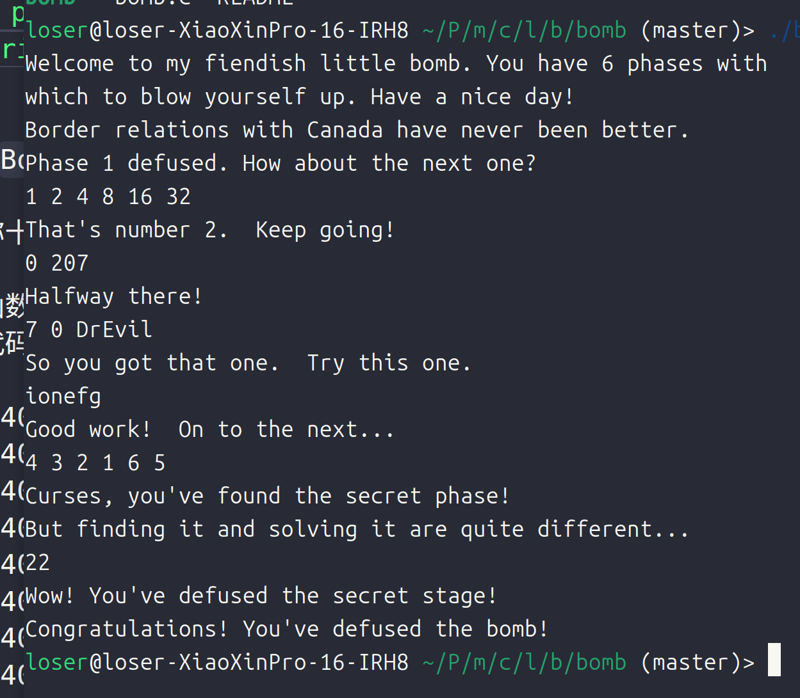

# csapp
## Lab1 dataLab
- 学习到了位运算的相关知识,以及`IEEE`标准下的浮点表示,以及`C`语言中有符号整数和无符号整数的二进制表示方式
## Lab2 bombLab
- [Lab2](lab2/lab2.md)
- 虽然有两个`phase`没有做出来(`phase_6`和隐藏关卡),但是学习到了`gdb`调试器的使用和各种不同的数据结构在内存中的存储方式,`x86`汇编语言以及寻址方式,理解了`mov`和`lea`指令的作用
- 通关截图:

## Lab3 attackLab
- [Lab3](lab3/attacklab/lab3.md)
- 虽然本`Lab`基本是 ~~抄~~ 的,但是还是有很多收获:
- 深入理解了`ret`,`pushq`,`popq`指令的用途,注意后面的两个指令的作用,`pushq`的作用也就是同时减少`%rsp`并且把后面一个寄存器的值放到栈底元素的位置,`popq`保存的就是原来的栈底的值,他们都可以把,`ret`指令可以跳转到 `%rsp` 指向的地址指示的指令位置执行这一个指令并且把`%rsp`减少的操作和栈空间无关(`subq,addq`)
- `Code-injection-attack`: 由于`ret`指令总是找到`%rsp`指令并且取出`%rsp`指令的内容(也就是指令的地址),所以如果通过操作`%rsp`指针的方式来存放指令,那么就可以让程序执行我们书写的指令而不去执行原来需要执行的指令,这一个技术的实现依赖于栈溢出异常
- `Return-orient-attack`: 由于栈空间是不断变化的,所以插入已经知道的指令的方式是难以实现的,所以只用利用已经存在的代码的方式进行攻击,比如如果一个指令的后面带有`ret`指令那么就可以依赖于`ret`指令完成跳转,这一种攻击方法依赖于程序中的指令的各个字节的分布是连续的,可以取得各个字节的空间(注意内存和栈空间的区别),程序在运行时可能产生栈空间,但是指令存储于内存中,所以指令的地址一般是不变化的,所以可以利用指令进行空间
- 以上的两种方法都依赖于栈溢出异常,所以在书写程序是需要避免这一个异常,`CPU`其实就是一个不断取得指令并且执行指令的机器,并不会智能的判断是否执行到正确的指令
- 比如`phase_5`和`phase_3`中一定需要注意把数据存储到指定的位置,如果返回一个值,那么此时是利用`mov`指令进行值赋值,所以可以保留原来的值,但是利用地址传递的方式,对应地址的栈空间会被释放,所以不可取(一定需要把数据包存在安全的栈空间的位置)
- 学会使用`cgdb`工具(基本和`gdb`一样)