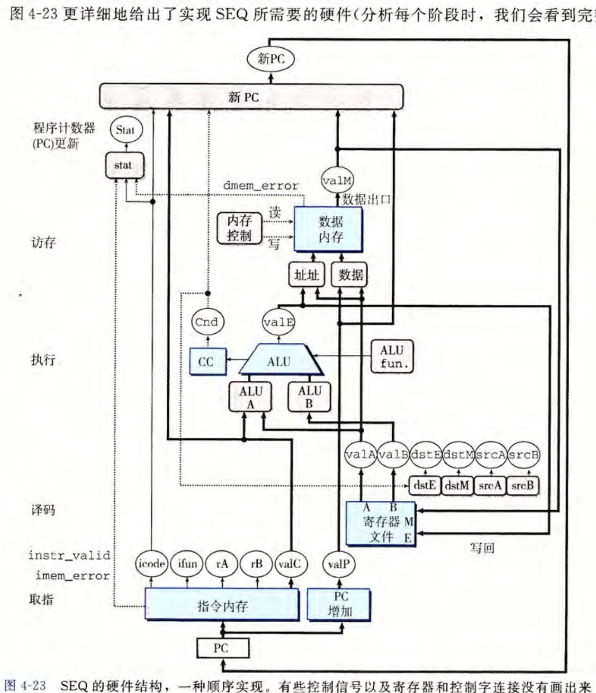

# archLab
## PartA
- 利用`Y86-64`写三个小程序
- 可以使用`yas`工具进行汇编,并且利用`yis`工具用于仿真
- 答案如下:
  - 第一个: [sum.yo](archlab-handout/sim/misc/PartA/sum.ys)
  - 第二个: [rsum.yo](archlab-handout/sim/misc/PartA/rsum.ys)
  - 第三个: [copy.yo](archlab-handout/sim/misc/PartA/copy.ys)
## PartB
- 目标: 实现`SEQ`模型下的`IIADDQ`指令,通过修改[seq-full.hcl](archlab-handout/sim/seq/seq-full.hcl)指令的方式进行修改各种信号的作用时机(此时不用管`ALU`的计算活动,只用关注输入信号即可)
- `SEQ`结构如下:

- 对于五个阶段(其实不包含写回)分别进行如下操作(针对于`IIADDQ`指令,也就是为一个寄存器加上一个立即数字):
  - 取指: 获取`rA`,`rB`,`valC`
  - 译码: 获取`R[rB] = valB`即可
  - 执行: `valE = valB + valC`(此时可以设置 `CC`)
  - 写回: `valE -> dstE`
  - 访存: 没有对应的操作
  - 更新: `PC`
- 注意`dstE` 表示需要写入`valE` 的寄存器的地址,`dstM` 表示需要写入`valM` 的寄存器地址
## PartC
- 目标: 通过修改: [pipe-full.hcl](archlab-handout/sim/pipe/pipe-full.hcl) 和 [ncopy.ys](archlab-handout/sim/pipe/ncopy.ys)来提高`ncopy.ys`的效率,测试脚本在: [run.sh](archlab-handout/sim/pipe/run.sh)
- 这里使用的几种改善方法:
  - 修改`pipe-full.hcl`实现`iaddq`指令,完成立即数和寄存器中目标数字的直接相加,减少了寄存器操作
  - 利用循环展开,大量的数据使用六路循环展开,剩余的数据使用三路循环展开提高效率
  - 在相邻并且相关的内存操作之间插入特定的操作,来达到气泡的效果,但是有充分利用了五级流水线
- 改善程序效率的几种方法:
  - 减少内存引用的次数: 也就是减少内存操作的次数,最好使用累积变量来存储操作的结果,最后把这一个累积变量写入到内存中
  - 进行循环展开,注意循环展开是为类提高各个指令的并行程度从而缩短关键路径的长度
  - 进行表达式的结合,这一种行为也是为了提高指令的并行程度
  - 使用内联函数提到具体函数
  - 可以使用条件传送(`cmove`)来代替条件控制(`JXXX`)