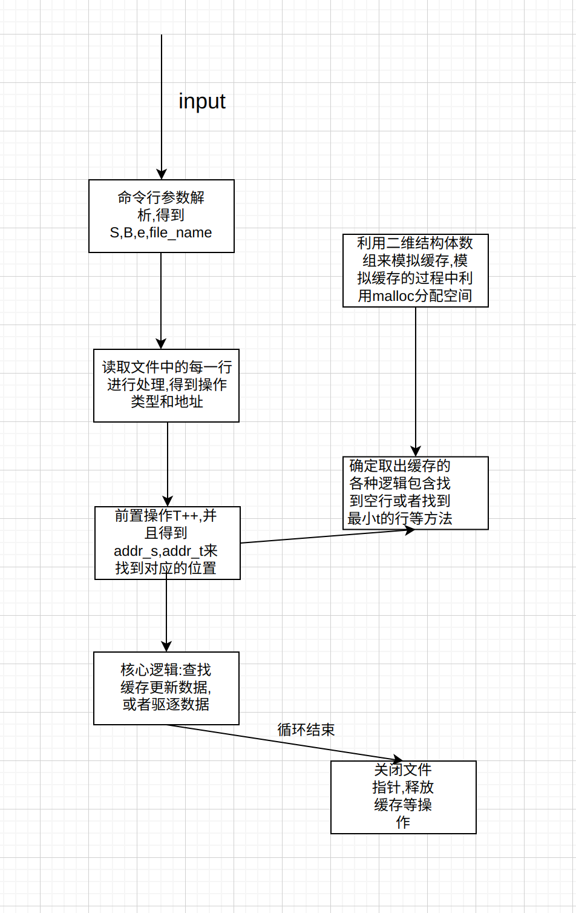

# CacheLab
## PartA
- 目标: 模拟`LRU`缓存,对于各种不同的行为的数据进行测试并且分别统计命中缓存,没有命中缓存和最终驱逐缓存的操作数量,有效的操作分为三种: `L`(`data load`),`S`(`data store`),`M`(`data modify = data load + data store`),这三种操作就是程序层面的而以
- 基础知识:
    - 对于读缓存:
      - 如果命中缓存,直接返回缓存中存储的数据即可
      - 如果没有命中缓存,那么就需要向下一层的结构发送请求获取数据,把数据写入到缓存中,之后把数据发送给`CPU`,并且这一个过程中可能发生驱逐现象
    - 对于写缓存:
      - 如果缓存命中,直接修改数据,可以采用直接写(也就是直接更新之后的层级),或者回写(之后这一个块被驱逐的时候才会写到下一个层级中)
      - 如果缓存没有命中,找到合适的位置写入缓存,并且采用以上的两种策略来写入到下一个层级中
- 注意事项: 这一个部分只是需要模拟缓存的行为不需要关注数据的存储和与下一个层级的交互,所以写缓存和读缓存的逻辑一样:
  - 命中: 返回`hit_count++`
  - 没有命中:
    - 有剩余的空间: `miss_count++`
    - 没有剩余的空间: `miss_count ++ , eviction_count++`
- `LRU(least-recently used)`缓存的实现方式这里利用一个数组进行实现,遍历找到数组中的空行,如果空行存储,那么就不需要发生驱逐实现,如果空行不存在就需要找到最先加入到数据中的元素(这里维护一个`T`变量,每一次加入变量递增并且每一个元素中有一个记录`t`的属性,遍历可以找到),总结就是最先加入并且最近没有使用的元素最先被驱逐
- 另外注意数据读写,命令行参数的解析过程: `getopt`,`fscanf`等函数
- 整体流程如下:

- 注意全局变量的使用,频繁使用的变量设置为全局变量
- 最终的代码: [`csim.c`](cachelab-handout/csim.c)
## PartB
### Part1
- 优化的矩阵为: `32*32`
- 优化思路: 进行矩阵分块,把矩阵分为`8 * 8`的小矩阵,这样就可以让`B`中的大多数范围中的元素命中,具体实现如下:
```c
void transpose_submit(int M, int N, int A[N][M], int B[M][N])
{
    int temp1 , temp2 , temp3 , temp4 , temp5 , temp6 , temp7 , temp8;
    // 采用矩阵分块的方式进行优化
    for(int i = 0 ; i < N ; i += 8) {
        for(int j = 0 ; j < M ; j += 8) {
            // 接下来只用关注一个块的逻辑
            // 此时 A 中所有位置都存储缓存了,之后都可以命中了
            for(int k = j ; k < j + 8 ; k ++) {
                temp1 = A[i][k];
                temp2 = A[i + 1][k];
                temp3 = A[i + 2][k];
                temp4 = A[i + 3][k];
                temp5 = A[i + 4][k];
                temp6 = A[i + 5][k];
                temp7 = A[i + 6][k];
                temp8 = A[i + 7][k];
                // 复制给 B 中对应的位置
                B[k][i] = temp1;
                B[k][i + 1] = temp2;
                B[k][i + 2] = temp3;
                B[k][i + 3] = temp4;
                B[k][i + 4] = temp5;
                B[k][i + 5] = temp6;
                B[k][i + 6] = temp7;
                B[k][i + 7] = temp8;
            }
        }
    }
}
```
- 最终的结果:

### Part2
- 目标: 矩阵大小为`64 * 64`,要求和之前一样,这一个问题比较困难,这是由于地址上的一个冲突
- 首先采用`8 * 8`的分块进行测试,追踪地址可以得到:

- 可以发现,由于如果利用`8 * 8`的分组,对于`A`而言,一组中的后面四个和前面四个发生冲突并且`B`中的前面四个也会和`A`中的前面四个发生冲突,所以此时就会发现,基本上`A`的命中率很低,驱逐率很高
- 所以考虑`4 * 4`的情况,此时虽然可以规避大部分的冲突,但是由于划分比较小,所以还是无法满足要求(这里无法利用满缓冲区),所以还是采用`8 * 8`的矩阵,在这一个`8 * 8`的矩阵中,可以进行局部的逆转,这是由于局部的逆转完毕之后,矩阵就会被逆转过来,所以可以对于`8 * 8`的矩阵进行逆转
- 可以进行如下操作(尽可能的增加命中率):

- 这样操作,就可以在下面`4`个元素驱逐上面元素的时候把原来的值存储在`B`中的对应位置了(虽然此时会发生驱逐,但是值已经存储在了寄存器中,不用读取缓存了)
- 代码实现:
```c
void hanlder_64(int M, int N, int A[N][M], int B[M][N])
{
    // 思路: 这里每一次 load 或者 store 的时候只可以利用 4 * 4 的方式,否则就会导致冲突
    // 可以把这些块划分为 多个 8 * 8 的块,在多个 8 * 8 的块的中间进行操作
    int temp1 , temp2 , temp3 , temp4 , temp5 , temp6 , temp7 , temp8;
    int x,y;
    for(int i = 0 ; i < N ; i += 8) {
        for(int j = 0 ; j < M ; j += 8) {
            // 1. 把 A 的左上逆转到 B 的左上 , 并且存储 A 的右边上面的逆转结果
            // 工作范围 i - (i + 4) , j - (j + 8)
            // 总是遵循 列优先的原则
            x = i;
            y = j;
            for( ; x < i + 4 ; x ++) {
                // 存储左上
                temp1 = A[x][y];
                temp2 = A[x][y + 1];
                temp3 = A[x][y + 2];
                temp4 = A[x][y + 3];
                // 存储右上
                temp5 = A[x][y + 4];
                temp6 = A[x][y + 5];
                temp7 = A[x][y + 6];
                temp8 = A[x][y + 7];
                // 翻转左上
                B[y][x] = temp1;
                B[y + 1][x] = temp2;
                B[y + 2][x] = temp3;
                B[y + 3][x] = temp4;
                // 保存右边上 (x , y) -> (y , x) -> (y - 4 , x + 4)
                B[y][x + 4] = temp5;
                B[y + 1][x + 4] = temp6;
                B[y + 2][x + 4] = temp7;
                B[y + 3][x + 4] = temp8;
            }
        // 2. 把 A 的左下移动到 B 的右上,并且把 B 的右上移动到 B 的左下
        // 工作范围: (i + 4) - (i + 8) , j - (j + 4)
        x = i + 4;
        y = j;
        // 采用列优先的方式
        for( ; y < j + 4 ; y ++) {
            // 记录左下
            temp1 = A[x][y];
            temp2 = A[x + 1][y];
            temp3 = A[x + 2][y];
            temp4 = A[x + 3][y];
            // 记录 B 的右上
            temp5 = B[y][x];
            temp6 = B[y][x + 1];
            temp7 = B[y][x + 2];
            temp8 = B[y][x + 3];
            // 进行翻转
            B[y][x] = temp1;
            B[y][x + 1] = temp2;
            B[y][x + 2] = temp3;
            B[y][x + 3] = temp4;
            // 保存信息到 B 的左下
            B[y + 4][x - 4] = temp5;
            B[y + 4][x - 3] = temp6;
            B[y + 4][x - 2] = temp7;
            B[y + 4][x - 1] = temp8;
        }
        // 3. 把 A 的右边下面翻转到 B 的右下
        // 工作范围 (i + 4) - (i + 8) , (j + 4) - (j + 8)
        x = i + 4;
        y = j + 4;
        for( ; x < i + 8 ; x ++) {
            temp1 = A[x][y];
            temp2 = A[x][y + 1];
            temp3 = A[x][y + 2];
            temp4 = A[x][y + 3];

            B[y][x] = temp1;
            B[y + 1][x] = temp2;
            B[y + 2][x] = temp3;
            B[y + 3][x] = temp4;
        }
    }
   
        
    } 
}
```
- 最终结果:

### Part3
- 目标: 此时的目标是提高`67 * 61`的矩阵的命中率
- 这里仍容易想到一种方法: 也就是把不规则的矩阵划分成为规则的矩阵,并且分别对于规则的部分进行逆转,逆转的过程中,可以对于需要被逆转的矩阵进行分块处理操作
- 这里可以把矩阵分为: `64 * 56`,`3 * 56`,`5 * 64`和`3 * 5`的矩阵分别分组求解
- 代码如下:
```c
void hanlder_odd(int M, int N, int A[N][M], int B[M][N])
{
    // 利用 8 * 8 的方块进行转置操作
    // N = 67 , M = 61, 需要反过来
    // M = 61 , N = 67
    // 67 * 61
    int temp1 , temp2 , temp3 , temp4 , temp5 , temp6 , temp7 , temp8;
    int i , j;
    for(i = 0 ; i < 64 ; i += 8) {
        for(j = 0 ; j < 56 ; j += 8) {
            for(int k = j ; k < j + 8 ; k ++) {
                temp1 = A[i][k];
                temp2 = A[i + 1][k];
                temp3 = A[i + 2][k];
                temp4 = A[i + 3][k];
                temp5 = A[i + 4][k];
                temp6 = A[i + 5][k];
                temp7 = A[i + 6][k];
                temp8 = A[i + 7][k];
                // 进行逆转操作
                B[k][i] = temp1;
                B[k][i + 1] = temp2;
                B[k][i + 2] = temp3;
                B[k][i + 3] = temp4;
                B[k][i + 4] = temp5;
                B[k][i + 5] = temp6;
                B[k][i + 6] = temp7;
                B[k][i + 7] = temp8;
            }
        }
    }
    // 可以处理剩下的部分了
    // 首先处理 3 * 56 的矩阵,可以分为 3 * 8 的方块
    for(i = 64 ; i < 67 ; i += 3) {
        for(j = 0 ; j < 56 ; j += 8) {
            for(int k = j ; k < j + 8 ; k ++) {
               temp1 = A[i][k];
               temp2 = A[i + 1][k];
               temp3 = A[i + 2][k];
               // 逆转
               B[k][i] = temp1;
               B[k][i + 1] = temp2;
               B[k][i + 2] = temp3;
            }
        }
    }
    // 最后处理 64 * 5 的方格,可以首先分为 5 * 64 的方格,采用 5 * 8 的方式进行分割
    for(i = 0 ; i < 64 ; i += 8) {
        for(j = 56 ; j < 61 ; j += 5) {
            for(int k = i ; k < i + 8 ; k ++) {
                temp1 = A[k][j];
                temp2 = A[k][j + 1];
                temp3 = A[k][j + 2];
                temp4 = A[k][j + 3];
                temp5 = A[k][j + 4];
                // 逆转
                B[j][k] = temp1;
                B[j + 1][k] = temp2;
                B[j + 2][k] = temp3;
                B[j + 3][k] = temp4;
                B[j + 4][k] = temp5;
            }
        }
    }
    // 最后处理 3 * 5 的方块即可
    // 直接划分成 3 * 5 即可
    for(i = 64 ; i < 67 ; i += 3) {
        for(j = 56 ; j < 61 ; j += 5) {
            for(int k = j ; k < j + 5 ; k ++) {
                temp1 = A[i][k];
                temp2 = A[i + 1][k];
                temp3 = A[i + 2][k];
                // 逆转
                B[k][i] = temp1;
                B[k][i + 1] = temp2;
                B[k][i + 2] = temp3;
            }
        }
    }
}
```
- 最终的命中率:

- 至此,`cacheLab`结束!