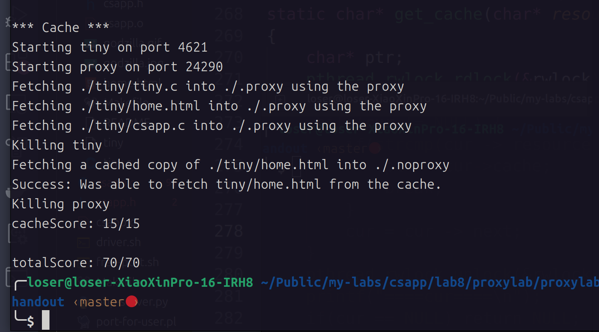

# ProxyLab
- `ProxyLab`是`csapp`的最后一个`Lab`了,这一个`Lab`我还是收获了很多的
## Part1
- 这一个部分需要实现一个可以顺序处理请求的代理服务器,一个代理服务器的作用也就是接受客户端的请求,分析客户端发来的`HTTP`报文获取到资源路径等信息,并且生成新的`HTTP`报文发送给服务器端,之后把服务器端的响应报文转发给客户端
- 这一部分的一个难点就是`IO`操作以及对于字符串操作函数的理解,在这里我学习到了`sscanf`函数更加进阶的应用,比如用于解析主机名称和`http`报文:
```c
// 解析 http 请求头 http://localhost:3306/home.html
sscanf(line , "%*[^/]\/\/%[^/]%s" , host , resource); 
// 解析主机名和端口号  localhost:3306
sscanf(host , "%[^:]:%s" , hostName , port);
// 解析请求头的键值对 User-Agent: curl
sscanf(host , "%[^:]: %s" , opt , value);
```
- 另外需要注意为了防止管道过早的关闭,需要捕捉`SIGPIPE`信号(也就是向没有读端的管道中写),否则就会由于客户端和服务器端之间的管道关闭导致数据传输失败,另外一个注意事项就是一定需要注意文件描述符的关闭和打开(~~这一点浪费了我很多时间~~)
## Part2
- 这一个部分是把自己的代理服务器改为并发的,这里有两种方式可以实现这一个操作,一种方式就是每一次得到一个请求就可以开启一个线程来执行请求,这一种方式的非常简单,只需要添加很少量的代码即可,我选择第二种方式: 利用预线程化的方式来处理请求,也就是可以把主线程当成生产者,同时我们预先定义消费者线程,并且定义一个数据结构为环形队列的缓冲区用于缓存没有处理的连接文件描述符,创建的线程的任务就是每一次都从文件描述符队列中取出元素并且执行相应的操作即可,这里中思想有一点像线程池
- 实现代码如下: [`proxy_thread.c`](proxylab-handout/proxy_thread.c)
## Part3
- 这一部分要求给代理服务器添加缓存,这里我使用的是`LRU`缓存,我是使用链表实现的,每一个节点维护这一个时间戳`T`,并且利用一个全局变量记录最新的时间戳,当获取元素或者插入元素的时候就可以更新对应的元素的时间戳为最新的时间戳,同时驱逐元素的时候也就是不断遍历链表找到`T`最小的元素知道驱逐到指定大小即可
- 这里我遇到的一个问题就是对于取出缓存中元素的操作,还需要更新`T`,所以如果利用一个读锁来锁住访问元素的操作是就会发生`T`和`Node`的线程安全问题,所以我这里选择另外利用一个互斥锁来保护`T`,同时利用读写锁来保护缓存链表
- 其实这里最好使用哈希表的结构进行缓存,这样可以把查找的时间复杂度降低到最小(最小为`O(1)`)

- 最终结果:
